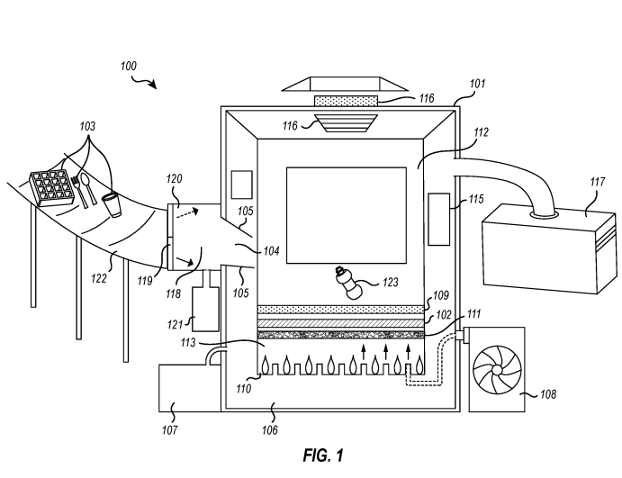
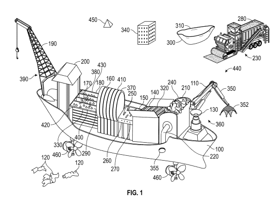
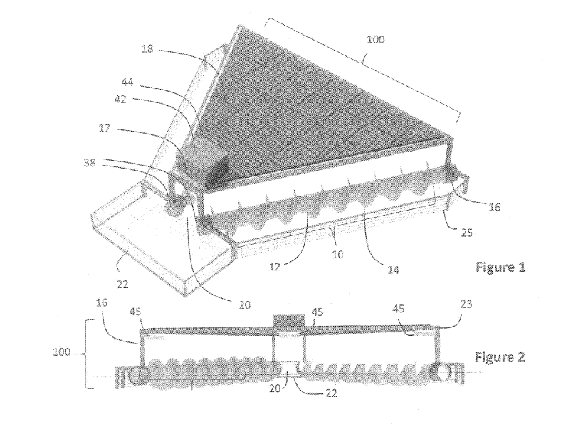
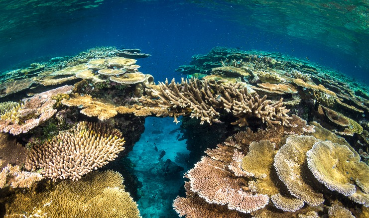
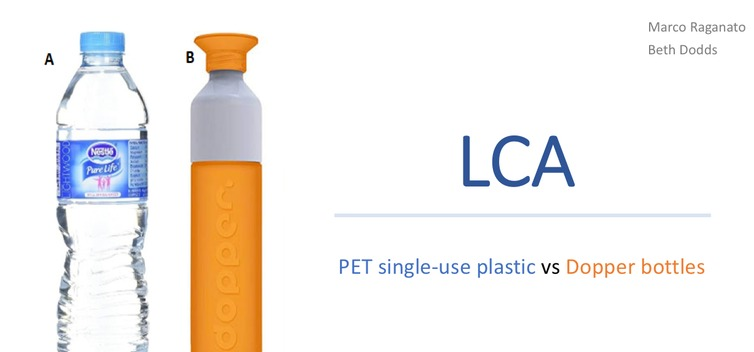
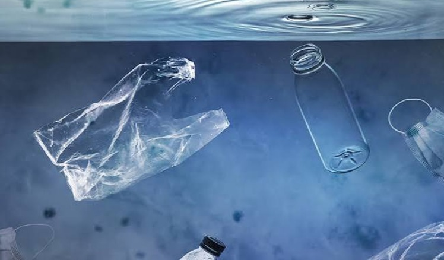

**Artículos científicos:**

1) "Progress towards the Sustainable Development Goal 14 (Life below water) in the context of Brazil: A multicriteria approach"
   
El artículo analiza los principales obstáculos que enfrenta Brasil para
alcanzar el ODS 14: Vida submarina. El estudio identifica problemas
ambientales, sociales y de gestión, entre ellos la contaminación marina,
el tratamiento insuficiente de aguas residuales, la ocupación de zonas
costeras y la falta de fiscalización ambiental. Los resultados muestran
que las políticas y la gestión ambiental representan una de las
principales barreras para avanzar en el cumplimiento del ODS 14. Por
ello, los autores resaltan la importancia de fortalecer las políticas
públicas, mejorar el control ambiental, invertir en investigación y
promover una mayor educación y participación de la sociedad en la
protección de los ecosistemas marinos.
[(1)](https://www.zotero.org/google-docs/?khWpoY)

2) "Implementing SDG 14: Opportunities and challenges in a Caribbean Small Island Developing State"

El artículo estudia la implementación del ODS 14 en Trinidad y Tobago,
un pequeño Estado insular cuya economía depende considerablemente de sus
recursos marinos. El estudio evidencia problemas como la contaminación
de las aguas costeras, el deterioro de los arrecifes de coral, manglares
y praderas marinas, además de amenazas relacionadas con la pesca y el
cambio climático. Los autores señalan que, aunque existen oportunidades
para mejorar la conservación marina, el país enfrenta dificultades
relacionadas con los recursos disponibles, el monitoreo y la gestión
ambiental. Por ello, se plantea la necesidad de fortalecer las políticas
de conservación, aumentar los recursos destinados a la protección marina
y mejorar el seguimiento de los avances hacia el ODS 14.
[(2)](https://www.zotero.org/google-docs/?fPt2j7)

3) "The challenge of reducing macroplastic pollution: Testing the effectiveness of a river boom under real environmental conditions"
   
El artículo evalúa el diseño y funcionamiento de dos prototipos de
centro flotante de bajo costo, adaptados a partir del modelo Clearbot,
destinados a la recolección de residuos plásticos en lagos de agua dulce
superficial. El estudio aborda la problemática de la acumulación de
desechos en fuentes hídricas e implementa un sistema electromecánico
basado en cinta transportadora, chasis de icopor y control mediante
microcontrolador. Los resultados experimentales y estadísticos
demostraron que los prototipos presentan un rendimiento
significativamente superior en la captura de envolturas plásticas en
comparación con otros residuos, manteniendo además la versatilidad para
recolectar botellas, tapas y vasos. Por ello, los autores destacan el
potencial de estos dispositivos como herramientas viables y adaptables
para reducir la contaminación por plásticos, señalando a su vez la
necesidad de realizar investigaciones adicionales en torno a su
autonomía y gasto energético.
[(3)](https://www.zotero.org/google-docs/?dKDYps)

| Artículo Científico | Tema | ¿Qué aporta? | Variables y Parámetros Clave |
| :--- | :--- | :--- | :--- |
| **Progress towards the Sustainable Development Goal 14 (Life below water) in the context of Brazil: A multicriteria approach.** *(Moretti et al., 2024)* | Identificación y priorización de las barreras que dificultan el cumplimiento del ODS 14 en Brasil (aspectos ambientales, técnicos, políticos, de gestión y socioeconómicos). | Propone una metodología multicriterio para identificar y jerarquizar las principales barreras que afectan el avance del ODS 14. La categoría con mayor peso e importancia fue **Política y gestión (43,68 %)**. | • **Categorización de barreras:** Clasificación cualitativa (ambiental, técnica, política, socioeconómica). • **Ponderación de peso relativo (%):** Importancia asignada a cada categoría. • **Dimensión Política y Gestión:** 43,68 %. • **Licenciamiento ambiental:** 15,07 %. |
| **Implementing SDG 14: Opportunities and challenges in a Caribbean Small Island Developing State.** *(Thompson, 2025)* | Evaluación del nivel de implementación del ODS 14 en Trinidad y Tobago, analizando oportunidades y dificultades para alcanzar sus metas de conservación marina. | Analiza el cumplimiento de las metas del ODS 14 en un pequeño Estado insular en desarrollo (SIDS) y plantea recomendaciones para acelerar su ejecución institucional. | • **Indicadores de avance ODS 14:** Nivel de cumplimiento de metas globales. • **Conservación de ecosistemas:** Estado y extensión de áreas marinas protegidas. • **Capacidad de gestión institucional:** Eficiencia de políticas gubernamentales locales. |
| **The challenge of reducing macroplastic pollution: Testing the effectiveness of a river boom under real environmental conditions.** *(Blettler et al., 2023)* | Evaluación de la eficacia de una barrera flotante (*river boom*) para capturar macroplásticos en condiciones ambientales reales de un río. | Prueba experimental de una tecnología de retención de residuos plásticos según diferentes configuraciones de la barrera. Demuestra que la eficiencia depende del tipo de plástico y la disposición instalada. | • **Muestra de residuos:** 52 artículos plásticos recopilados. • **Diversidad de polímeros:** 13 tipos identificados. • **Configuración de la barrera:** Configuración C (≈37 % eficacia) vs. Slash (<10 %). • **Eficiencia de captura:** Rango de 0–100 %. • **Propiedades físicas:** Forma, tipo de polímero y flotabilidad del residuo. |

**Patentes:**

4) "METHOD FOR EFFICIENT COLLECTION AND DESTRUCTION OF PLASTIC WASTE IN BODIES OF WATER"

Se propone un método para recolectar y destruir residuos plásticos
presentes en cuerpos de agua. El sistema combina mecanismos de
recolección y filtración con un proceso de tratamiento
térmico-catalítico que permite procesar los residuos recuperados. Su
finalidad es disminuir la acumulación de plástico en ambientes acuáticos
y contribuir a la reducción de la contaminación marina. Esta propuesta
se relaciona principalmente con el ODS 14: Vida Submarina, debido a su
enfoque en la reducción de residuos plásticos en los ecosistemas
acuáticos. [(4)](https://www.zotero.org/google-docs/?CAkMvK)

5) "MARINE VESSEL WITH INTEGRATED PLASTIC SHREDDING AND PELLETIZING SYSTEM FOR OCEAN CLEANUP AND REPURPOSING INTO PLASTIC ASPHALT"

Una solución tecnológica plantea el uso de una embarcación capaz de
recolectar residuos plásticos marinos, triturarlos y transformarlos en
pellets reutilizables. El sistema incorpora sensores para localizar
residuos y utiliza fuentes de energía renovable, como paneles solares y
turbinas eólicas. El plástico recolectado puede ser procesado para su
posterior utilización en la fabricación de asfalto plástico,
contribuyendo a reducir la acumulación de residuos en el océano y
promoviendo su reutilización.
[(5)](https://www.zotero.org/google-docs/?Y6Sgch)

6) "APPARATUS AND METHOD FOR COLLECTING MARINE DEBRIS"

Mediante un sistema compuesto por dos tornillos helicoidales dispuestos
en forma de V, se plantea la recolección de residuos flotantes presentes
en mares, océanos, lagos y deltas de ríos. Estos mecanismos permiten
dirigir los residuos hacia un recipiente de almacenamiento, mientras que
el dispositivo puede incorporar motores eléctricos y paneles solares
para facilitar su desplazamiento y funcionamiento. La propuesta busca
disminuir la presencia de residuos en cuerpos de agua y contribuir a la
conservación de los ecosistemas marinos.
[(6)](https://www.zotero.org/google-docs/?dQA2ip)

# Tabla Comparativa de Patentes de Recolección y Procesamiento de Plásticos Marinos

| Patente | Tema Principal | Aporte / Innovación | Variables y Parámetros Térmico-Operativos |
| :--- | :--- | :--- | :--- |
| **US12097545B2** *(Metropoulos P., 2024)* | Recolección y destrucción *in situ* de residuos plásticos acuáticos mediante oxidación. | Implementa un sistema flotante de destrucción que no solo recolecta, sino que elimina el plástico recolectado en el sitio mediante un proceso de **oxidación en lecho fluidizado** (usando sílice/arena fluidizada), evitando el traslado de desechos a tierra. | • **Temperatura del lecho:** ~500 °C a 800 °C (oxidación térmica). • **Flujo de aire/gas de fluidización:** Regulado para mantener el medio sólido en suspensión. • **Tasa de alimentación:** Controlada según la densidad del plástico capturado. • **Eficiencia de captura:** Flujo/velocidad de recolección de agua y barrido en superficie. |
| **US12275167B1** *(Cook Z. & Carson GD, 2025)* | Embarcación marina con sistema integrado de trituración, pelletizado y valorización de plástico. | Integra dentro del mismo buque la captura, la trituración y la extrusión/pelletización para transformar los plásticos marinos en un insumo industrial reutilizable (**asfalto plástico / mezclas bituminosas**). | • **Tamaño de partícula de triturado:** Granulometría de 2 mm a 10 mm. • **Temperatura de extrusión/pelletizado:** Rango de 160 °C a 240 °C (según resinas PET/PE/PP). • **Capacidad de procesamiento:** Rango dinámico en toneladas de plástico procesado por hora (t/h). • **Proporción de mezcla:** Porcentaje de adición de pellet plástico a la mezcla asfáltica target. |
| **US11661156B2** *(Svorcan R., 2023)* | Aparato y método mecánico/hidrodinámico para recolección de desechos marinos. | Sistema mecánico asistido por dinámica de fluidos (barreras mecánicas/deflectoras y flujo asistido) diseñado para capturar y concentrar residuos plásticos flotantes y sumergidos de forma continua sin dañar la fauna marina. | • **Velocidad de desplazamiento/flujo:** 0.5 a 2.5 nudos para evitar sobrepaso de desechos. • **Profundidad de recolección/calado:** Ajustable de 0.5 m hasta 3 m bajo la superficie. • **Apertura de barrera de captura:** Ángulo y ancho de barrido dinámico (m). • **Capacidad de almacenamiento temporal:** En volumen (m³) o masa (kg). |

**Productos comerciales:**

7) "Efectos toxicopatológicos del filtro UV de protección solar, oxibenzona (benzofenona-3), sobre las planulas de coral y las células primarias cultivadas y su contaminación ambiental en Hawai y los EE. Islas Vírgenes"

El artículo analiza los efectos toxicopatológicos de la oxibenzona
(benzofenona-3), un filtro UV común en los protectores solares, sobre
las plánulas de coral y células primarias cultivadas, así como su nivel
de contaminación ambiental en arrecifes de Hawái y las Islas Vírgenes de
los EE. UU. El estudio identifica que este compuesto actúa como un
disruptor endocrino que induce el blanqueamiento, la deformación, el
daño al ADN y la mortandad en las larvas de coral a concentraciones
extremadamente bajas. Los resultados muestran que la contaminación por
oxibenzona representa una amenaza significativa para la resiliencia y
supervivencia de los arrecifes coralinos, especialmente en zonas con
alta afluencia turística. Por ello, los autores destacan la necesidad de
mitigar el uso de este tipo de sustancias químicas en productos de
cuidado personal y promover el uso de alternativas ecotóxicamente
seguras para garantizar la conservación de los ecosistemas marinos.
[(7)](https://www.zotero.org/google-docs/?RFGfRs)

   
  <b>Fuente:</b> <a href="https://es.mongabay.com/2020/01/cremas-solares-corales-islas-virgenes/">Mongabay Periodismo Ambiental Independiente</a>

8) "Degradación marina y ecotoxicidad de bolsas de plástico convencionales, recicladas y compostables"

El artículo analiza el mecanismo de fotoinactivación parcial del
complejo liberador de oxígeno (OEC) como estrategia para regular la
fotosíntesis en el pasto marino *Zostera marina* bajo exposición a la
luz. El estudio identifica cambios a nivel proteómico y fisiológico,
demostrando que la planta no activa vías tradicionales de disipación de
energía o flujos alternativos de electrones para gestionar el exceso de
luz. Los resultados muestran que este consumo reducido de electrones
permite a la especie optimizar el uso de los recursos electrónicos
disponibles para mantener una fotosíntesis y asimilación de carbono
eficientes sin generar estrés oxidativo. Por ello, los autores resaltan
cómo esta adaptación evolutiva única facilita la supervivencia y el
rendimiento fotosintético de *Z. marina* en su hábitat marino sumergido.
[(8)](https://www.zotero.org/google-docs/?trN3Q8)

9) "¿Qué tan sostenible y seguro es beber de las botellas de recarga y reutilización? Un análisis basado en la evaluación del ciclo de vida (ACV) y la calidad microbiológica del agua"
    
El artículo analiza la sostenibilidad y la seguridad microbiológica del
agua al consumir en botellas rellenables y reutilizables, evaluando su
impacto ambiental mediante el análisis del ciclo de vida (ACV). El
estudio identifica que, si bien el uso de envases reutilizables
contribuye significativamente a reducir la generación de residuos
plásticos, existen riesgos asociados a la contaminación bacteriana del
agua según el hábito de uso y la frecuencia de lavado. Los resultados
muestran que para maximizar los beneficios ambientales sin comprometer
la salud humana es indispensable mantener una higiene adecuada del
recipiente. Por ello, los autores destacan la importancia de promover
buenas prácticas de uso y limpieza en la población, así como fomentar el
diseño de envases de fácil desinfección para garantizar un consumo
seguro y ambientalmente sostenible.
[(9)](https://www.zotero.org/google-docs/?SYh2wb)

**Tesis:**

10) "PRESENCIA DE MICROPLÁSTICOS EN SEIS PLAYAS DEL DEPARTAMENTO DE LA LIBERTAD, 2022"
    
La tesis analiza la presencia y abundancia de microplásticos en seis
playas de la zona costera del departamento de La Libertad durante el año
2022. El estudio identifica los niveles de contaminación antropogénica
en estas áreas marinas, determinando el tipo de partículas y polímeros
presentes, así como los principales factores locales de presión
ambiental que contribuyen a su acumulación. Los resultados evidencian un
impacto directo de la contaminación por plásticos en el ecosistema
costero, lo que representa una amenaza para la biodiversidad marina y la
salud ambiental. Por ello, el autor resalta la necesidad de implementar
medidas de mitigación, fortalecer el control ambiental en las zonas de
playa e impulsar estrategias de gestión de residuos de mayor eficacia
para proteger el litoral liberteño.
[(10)](https://www.zotero.org/google-docs/?S5trRi)

11) "Impacto socioambiental por residuos sólidos en las playas de la Bahía de Paracas y propuesta de estrategias de manejo - provincia de Pisco, año 2021"

La tesis evalúa el impacto socioambiental generado por la acumulación de
residuos sólidos en las playas de la Bahía de Paracas durante el año
2021. El estudio identifica los principales tipos de desechos presentes,
las fuentes de contaminación antropogénica y las afecciones directas
tanto al ecosistema marino costero como a las actividades
socioeconómicas locales de la provincia de Pisco. Los resultados
muestran que la inadecuada disposición y gestión de los residuos
representa un problema crítico para la conservación del entorno y la
salud pública. Por ello, el autor propone un conjunto de estrategias de
manejo integral orientadas a fortalecer el control ambiental, optimizar
la gestión de residuos y promover la participación comunitaria para
mitigar la contaminación en el litoral de la bahía.
[(11)](https://www.zotero.org/google-docs/?ndTGVy)

   
  <b>Fuente:</b> Agencia Peruana de Noticias <a href="https://andina.pe/agencia/noticia-paracas-aprueba-primer-plan-contra-lucha-basura-marina-el-pais-530026.aspx">Andina</a>

12) "Prototipo de centro flotante para la recolección de residuos  plásticos contaminantes en un lago de agua dulce"

La tesis evalúa el impacto socioambiental generado por la acumulación de
residuos sólidos en las playas de la Bahía de Paracas durante el año
2021. El estudio identifica los principales tipos de desechos presentes,
las fuentes de contaminación antropogénica y las afecciones directas
tanto al ecosistema marino costero como a las actividades
socioeconómicas locales de la provincia de Pisco. Los resultados
muestran que la inadecuada disposición y gestión de los residuos
representa un problema crítico para la conservación del entorno y la
salud pública. Por ello, el autor propone un conjunto de estrategias de
manejo integral orientadas a fortalecer el control ambiental, optimizar
la gestión de residuos y promover la participación comunitaria para
mitigar la contaminación en el litoral de la bahía.
[(12)](https://www.zotero.org/google-docs/?t3avYQ)

 

### Tabla Comparativa de Tesis sobre Residuos Plásticos y Gestión Ambiental

| Tesis / Fuente | Tema Principal | Aporte / Innovación | Variables y Parámetros Operativos |
| :--- | :--- | :--- | :--- |
| **Presencia de microplásticos en seis playas del departamento de La Libertad, 2022** *(UPN, 2022)* [Ver repositorio](https://repositorio.upn.edu.pe/item/adfdeec8-c977-4ab1-8305-bce25952dda1) | Cuantificación e identificación del nivel de contaminación por microplásticos en la zona costera de La Libertad. | Evaluación comparativa de la abundancia, morfología (fibras, fragmentos, filmes) y distribución de polímeros según la presión antropogénica de cada playa. | • **Muestreo:** Sedimentos superficiales e intermareales en 6 playas. • **Abundancia:** Concentración de partículas por kg/m². • **Caracterización:** Tipo, color y tamaño de las partículas sintéticas. |
| **Impacto socioambiental por residuos sólidos en las playas de la Bahía de Paracas y propuesta de estrategias de manejo** *(UNICA, 2021)* [Ver repositorio](https://repositorio.unica.edu.pe/items/d69e1c80-78f1-4019-b55f-71e79c049d1c) | Diagnóstico del impacto socioambiental de la basura marina en Pisco y propuesta de un plan integral de gestión de residuos. | Formulación de estrategias operativas y comunitarias integradas con análisis estadístico (Chi-cuadrado) para evaluar el impacto en la salud pública y el ecosistema costero. | • **Evaluación:** Tipificación de desechos sólidos y fuentes antrópicas. • **Impacto:** Alteración del ecosistema y actividades socioeconómicas. • **Estrategias:** Control ambiental, optimización del recojo y participación comunitaria. |
| **Prototipo de centro flotante para la recolección de residuos plásticos contaminantes en un lago de agua dulce** *(USC, 2023)* [Ver repositorio](https://repositorio.usc.edu.co/server/api/core/bitstreams/b340bd99-dec7-45f2-a7fd-8dc990865f47/content) | Diseño e implementación de un dispositivo mecatrónico flotante para captura in situ de plásticos en cuerpos de agua dulce. | Desarrollo de un sistema de retención/captura de basura flotante para evitar la dispersión de macroplásticos sin requerir infraestructura fija costosa. | • **Entorno:** Cuerpos de agua dulce lenticos (lagos/lagunas). • **Mecanismo:** Flotabilidad, capacidad de carga y retención de basura. • **Operatividad:** Captura continua de residuos superficiales. |

REFERENCIAS

> [1.](https://www.zotero.org/google-docs/?ei0lhi) [Moretti V, Corraini
> NR, Melo EL, Scherer MEG, Colmenero JC. Progress towards the
> Sustainable Development Goal 14 (Life below water) in the context of
> Brazil: A multicriteria approach. Sustainable Futures. diciembre de
> 2024;8:100410.
> doi:10.1016/j.sftr.2024.100410](https://www.zotero.org/google-docs/?ei0lhi)
>
> [2.](https://www.zotero.org/google-docs/?ei0lhi) [Thompson R.
> Implementing SDG 14: Opportunities and challenges in a Caribbean Small
> Island Developing State. Marine Policy. agosto de 2025;178:106713.
> doi:10.1016/j.marpol.2025.106713](https://www.zotero.org/google-docs/?ei0lhi)
>
> [3.](https://www.zotero.org/google-docs/?ei0lhi) [Blettler MCM,
> Agustini E, Abrial E, Piacentini R, Garello N, Wantzen KM, et al. The
> challenge of reducing macroplastic pollution: Testing the
> effectiveness of a river boom under real environmental conditions.
> Science of The Total Environment. 20 de abril de 2023;870:161941.
> doi:10.1016/j.scitotenv.2023.161941](https://www.zotero.org/google-docs/?ei0lhi)
>
> [4.](https://www.zotero.org/google-docs/?ei0lhi) [Metropoulos P.
> Method for efficient collection and destruction of plastic waste in
> bodies of water \[Internet\]. US12097545B2, 2024 \[citado 2 de
> septiembre de 2026\]. Disponible en:
> https://patents.google.com/patent/US12097545B2/en](https://www.zotero.org/google-docs/?ei0lhi)
>
> [5.](https://www.zotero.org/google-docs/?ei0lhi) [Cook Z, Carson GD.
> Marine vessel with integrated plastic shredding and pelletizing system
> for ocean cleanup and repurposing into plastic asphalt \[Internet\].
> US12275167B1, 2025 \[citado 2 de septiembre de 2026\]. Disponible en:
> https://patents.google.com/patent/US12275167B1/en](https://www.zotero.org/google-docs/?ei0lhi)
>
> [6.](https://www.zotero.org/google-docs/?ei0lhi) [SVORCAN R. Apparatus
> and method for collecting marine debris \[Internet\]. US11661156B2,
> 2023 \[citado 2 de septiembre de 2026\]. Disponible en:
> https://patents.google.com/patent/US11661156B2/en](https://www.zotero.org/google-docs/?ei0lhi)
>
> [7.](https://www.zotero.org/google-docs/?ei0lhi) [Downs CA,
> Kramarsky-Winter E, Segal R, Fauth J, Knutson S, Bronstein O, et al.
> Toxicopathological Effects of the Sunscreen UV Filter, Oxybenzone
> (Benzophenone-3), on Coral Planulae and Cultured Primary Cells and Its
> Environmental Contamination in Hawaii and the U.S. Virgin Islands.
> Arch Environ Contam Toxicol. febrero de 2016;70(2):265-88.
> doi:10.1007/s00244-015-0227-7 PubMed PMID:
> 26487337.](https://www.zotero.org/google-docs/?ei0lhi)
>
> [8.](https://www.zotero.org/google-docs/?ei0lhi) [Zhao W, Yang XQ,
> Zhang QS, Tan Y, Liu Z, Ma MY, et al. Photoinactivation of the
> oxygen-evolving complex regulates the photosynthetic strategy of the
> seagrass Zostera marina. Journal of Photochemistry and Photobiology B:
> Biology. septiembre de 2021;222:112259.
> doi:10.1016/j.jphotobiol.2021.112259](https://www.zotero.org/google-docs/?ei0lhi)
>
> [9.](https://www.zotero.org/google-docs/?ei0lhi) [Summa D, Costa S,
> Tamisari E, Castaldelli G, Tamburini E. How sustainable and safe is
> drinking from refill-and-reuse bottles? An analysis based on
> life-cycle assessment (LCA) and microbiological quality of water.
> Environ Res. 1 de enero de 2026;288(Pt 1):123212.
> doi:10.1016/j.envres.2025.123212 PubMed PMID:
> 41175910.](https://www.zotero.org/google-docs/?ei0lhi)
>
> [10.](https://www.zotero.org/google-docs/?ei0lhi) [Giamcarlo Jesus
> Cedano Zavaleta GJCZ. PRESENCIA DE MICROPLÁSTICOS EN SEIS  PLAYAS DEL
> DEPARTAMENTO DE LA  LIBERTAD. "PRESENCIA DE MICROPLÁSTICOS EN SEIS 
> PLAYAS DEL DEPARTAMENTO DE LA  LIBERTAD, 2022".
> 2022.](https://www.zotero.org/google-docs/?ei0lhi)
>
> [11.](https://www.zotero.org/google-docs/?ei0lhi) [Impacto
> socioambiental por residuos sólidos en las playas de la Bahía de
> Paracas y propuesta de estrategias de manejo - provincia de Pisco, año
> 2021 \[Internet\]. \[citado 2 de septiembre de 2026\]. Disponible en:
> https://repositorio.unica.edu.pe/items/d69e1c80-78f1-4019-b55f-71e79c049d1c](https://www.zotero.org/google-docs/?ei0lhi)
>
> [12.](https://www.zotero.org/google-docs/?ei0lhi) [Larrahondo-Pantoja
> CD, Rentería-Coime KJ, Cárdenas-Talero JL. Prototipo de centro
> flotante para la recolección de residuos plásticos contaminantes en un
> lago de agua dulce. 2023.](https://www.zotero.org/google-docs/?ei0lhi)
